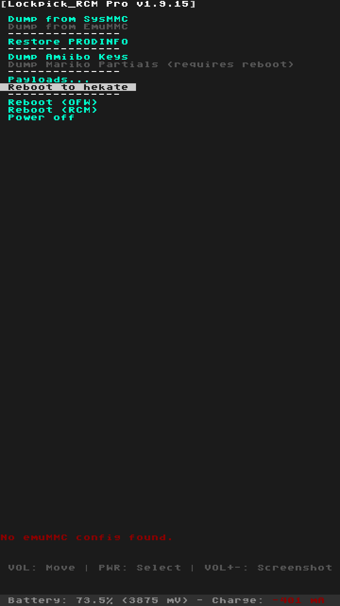

# Lockpick_RCM_Pro

<p align="center">
  
</p>

Lockpick_RCM_Pro is an enhanced bare-metal payload that extracts encryption keys and dumps PRODINFO for use in file handling software like **hactool**, **hactoolnet/LibHac**, **ChoiDujour**, etc., all without booting into Horizon OS.

> **Based on** [Lockpick_RCMaster](https://github.com/THZoria/Lockpick_RCMaster) by THZoria

> **Note:** Due to changes in firmware 7.0.0 and beyond, the Lockpick homebrew can no longer derive the latest keys. However, this limitation doesn't apply in the boot-time environment, allowing Lockpick_RCM to function properly.

## Usage

1. **Recommended:** Place **Minerva** on your SD card for optimal performance, especially when dumping titlekeys. You can get it from the latest [Hekate](https://github.com/CTCaer/hekate/releases) release. Place the file at:
   ```
   /bootloader/sys/libsys_minerva.bso
   ```
2. Launch `Lockpick_RCM.bin` using your preferred payload injector or chainloader.
3. Files will be saved to your SD card:
   - `/switch/prod.keys` - Production keys
   - `/switch/title.keys` - Title keys
   - `/backup/[emmcID]/partitions/PRODINFO` - Hekate-compatible backup (encrypted)
   - `/backup/[emmcID]/dumps/prodinfo.enc` - Encrypted PRODINFO archive
   - `/backup/[emmcID]/dumps/prodinfo.dec` - Decrypted PRODINFO archive
   - `/switch/screenshot/lockpick_rcm_YYYYMMDD_HHMMSS.bmp` - Screenshots (optional)

> This release also includes the Falcon keygen from [Atmosphère-NX](https://github.com/Atmosphere-NX/Atmosphere).

## Enhanced Features

### PRODINFO Backup
Lockpick_RCM_Pro automatically backs up your PRODINFO partition during key extraction using a Hekate-compatible folder structure:

**Backup Structure:**
```
backup/[emmcID]/
├── partitions/
│   └── PRODINFO          (Encrypted - Hekate compatible)
└── dumps/
    ├── prodinfo.enc      (Encrypted - NXNandManager compatible)
    └── prodinfo.dec      (Decrypted - for analysis)
```

**Features:**
- **Device ID separation** - Each device has its own folder (matches Hekate's format)
- **Hekate compatible** - `partitions/PRODINFO` can be restored using Hekate
- **NXNandManager compatible** - `.enc`/`.dec` files for analysis tools
- **Automatic migration** - Old backups from `/switch/` are automatically migrated

> **Important:** Keep these files safe! PRODINFO contains device-unique calibration data and certificates that cannot be regenerated if lost.

### Screenshot Capability
Take screenshots of the payload interface at any time:
- **In menus:** Press **VOL+ and VOL-** simultaneously to capture the screen
- **After key extraction:** Press **VOL+** to save a screenshot
- Screenshots are saved as BMP files with timestamps in `/switch/screenshot/`
- Filename format: `lockpick_rcm_YYYYMMDD_HHMMSS.bmp`
- 2-second cooldown between screenshots to prevent accidental captures

## Mariko-Specific Keys

Mariko units (V2 and Lite models) contain unique keys and protected keyslots. To extract these keys, you will need to use the `/switch/partialaes.keys` file along with a brute-forcing tool like [PartialAesKeyCrack](https://files.sshnuke.net/PartialAesKeyCrack.zip). The process involves:

1. Open `partialaes.keys` and observe the keyslot data.
2. Use the following command format:
   ```
   PartialAesKeyCrack.exe <num1> <num2> <num3> <num4> --numthreads=[N]
   ```
   Replace `[N]` with the number of threads to utilize (not exceeding your CPU's core count).

### Keyslots Overview

| Keyslot | Name                         | Notes                                         |
| ------- | ---------------------------- | --------------------------------------------- |
| 0-11    | `mariko_aes_class_key_xx`    | Not used by device (set by bootrom)           |
| 12      | `mariko_kek`                 | Used for master key derivation                |
| 13      | `mariko_bek`                 | Used for BCT and package1 decryption          |
| 14      | `secure_boot_key`            | Device unique (for personal records)          |
| 15      | Secure storage key           | Device unique (not used on retail/dev units)  |

**Example:**
```
12
11111111111111111111111111111111 22222222222222222222222222222222 33333333333333333333333333333333 44444444444444444444444444444444
```

To brute force `mariko_kek`, run:
```
PartialAesKeyCrack.exe 11111111111111111111111111111111 22222222222222222222222222222222 33333333333333333333333333333333 44444444444444444444444444444444 --numthreads=12
```

> On a high-performance CPU like the Ryzen 3900x, this process takes about 45 seconds using 24 threads.

For more details on the hardware flaw utilized: [System Flaws - Hardware](https://switchbrew.org/wiki/Switch_System_Flaws#Hardware)

## Building

1. Install [devkitARM](https://devkitpro.org/).
2. Run:
   ```
   make
   ```

## Acknowledgments

This project owes a lot to [Hekate](https://github.com/CTCaer/hekate), and special thanks go to **CTCaer** for his valuable advice, expertise, and humor throughout the development process.

## License

Lockpick_RCM is licensed under the **GPLv2**. The save processing module is adapted from [hactool](https://github.com/SciresM/hactool), licensed under ISC.

## Credits and Attribution

This project builds upon the excellent work of:
- **[THZoria](https://github.com/THZoria/Lockpick_RCMaster)** - Lockpick_RCMaster base
- **[shchmue](https://github.com/shchmue)** - Original Lockpick_RCM
- **[CTCaer](https://github.com/CTCaer/hekate)** - Hekate bootloader and libraries
- **[Atmosphere-NX](https://github.com/Atmosphere-NX/Atmosphere)** - Falcon keygen
- **ReSwitched community** - Source code preservation and development support

## Disclaimer

This tool is for educational and backup purposes only. Always keep your PRODINFO backups in a safe location. The authors are not responsible for any damage or data loss. 
